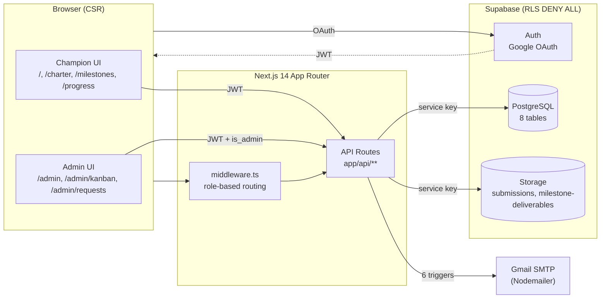
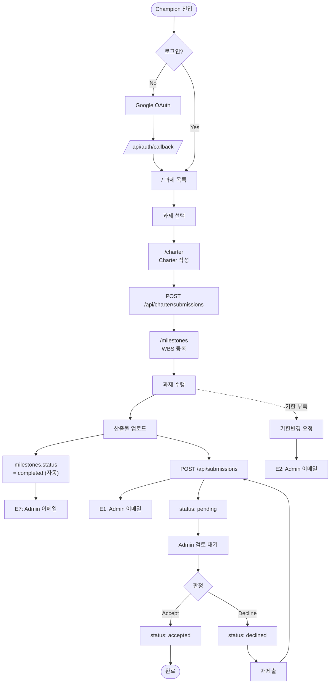
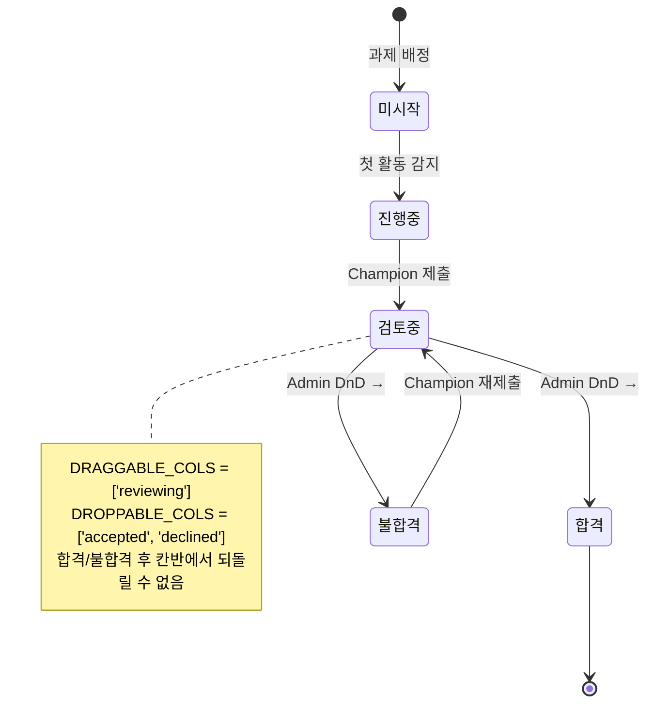
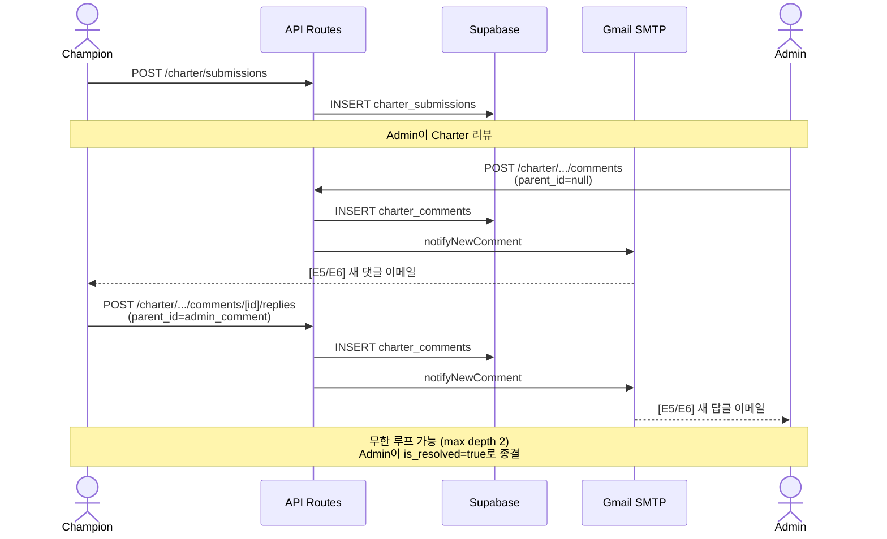
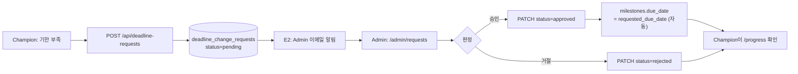
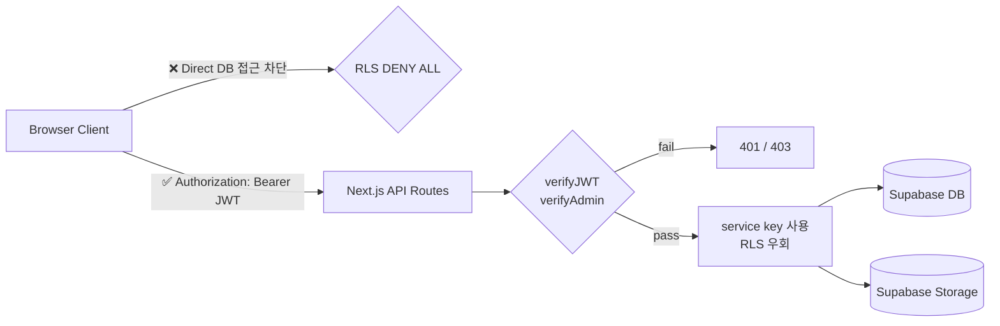
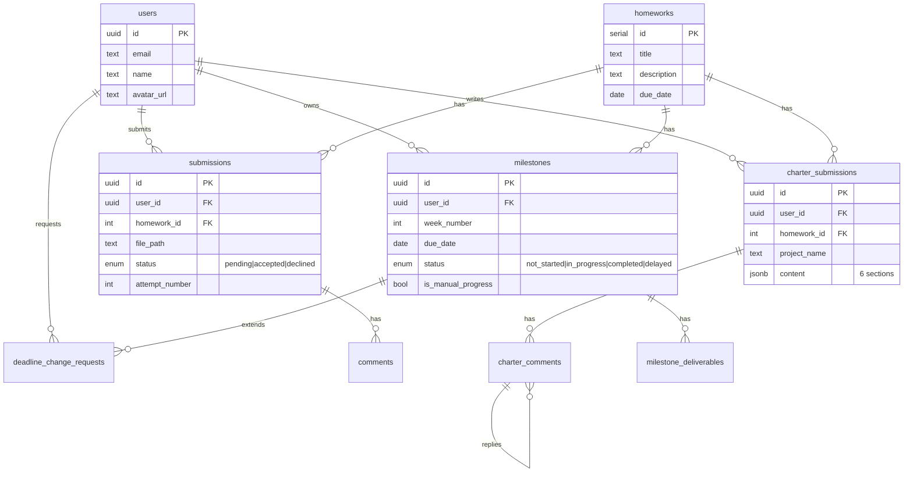

# AX Homework Submission Platform — PRD

> **버전** 1.0 · **작성일** 2026-05-19 · **대상** Strategy Lead
> **상태** Internal Review · **저장소** `AX/ax-homework-submission`

---

## 0. Executive Summary (IR-style)

### One-liner
**AX 프로그램의 과제 정의 → 수행 → 검토 → 피드백을 단일 플랫폼에서 처리하는 풀스택 웹 애플리케이션.**

### 왜 지금인가 (Why Now)
- AX 프로그램은 다수의 챔피언(학생/수강생)이 멀티-마일스톤 과제를 수행하는 구조이나, **현재 제출·검토 워크플로우가 분산**되어 있어 관리 비용이 누적됨 (이메일/스프레드시트/Slack 분산 운영).
- 본 플랫폼은 **과제정의서(Charter) → WBS 마일스톤 → 산출물 제출 → 합격 판정**의 전 라이프사이클을 단일 시스템에 통합.

### 핵심 차별점
| 항목 | 기존 운영 | 본 플랫폼 |
|---|---|---|
| Charter 작성 | Word 첨부 | TipTap WYSIWYG + DOCX 내보내기 |
| 진행 가시화 | 스프레드시트 수동 갱신 | Gantt + 칸반 자동 동기화 |
| 검토 워크플로우 | 이메일 회람 | **단방향 DnD 칸반** (검토중 → 합격/불합격) |
| 피드백 루프 | Slack/대면 | 양방향 댓글 + 이메일 자동 알림 (6 트리거) |
| 데이터 보안 | 파일 서버 | Supabase RLS **DENY ALL** + 서버 API 단일 게이트웨이 |

### 현재 진척도 (2026-05-19 기준)
- **기능 완성도**: 핵심 9개 영역 중 8개 완성 (88%) — 대시보드/리포팅만 골격 단계
- **커밋 수**: 39+ (브랜치 `feature/ui-ux-enhancements` 32 commits)
- **PR #1**: 머지 대기 중 (UI/UX 폴리시 마무리)
- **데이터 모델**: 8개 핵심 테이블 + 2개 Storage 버킷, RLS 정책 적용 완료

### KPI 목표 (런칭 후 90일)
| 지표 | 목표 | 측정 방식 |
|---|---|---|
| 챔피언 활성률 | 주간 활성 ≥ 70% | 로그인 + Charter/Milestone 1회 이상 |
| 평균 검토 리드타임 | 제출 → 판정 ≤ 24h | submissions.submitted_at → status 변경 |
| Charter 제출률 | 배정 과제 대비 ≥ 90% | charter_submissions / homeworks per user |
| 기한변경 자동승인 흐름 | 응답 ≤ 12h | deadline_change_requests.reviewed_at |
| 이메일 도달률 | ≥ 99% | Nodemailer delivery logs |

### Top 3 Risk
1. **Gmail SMTP 의존성** — 발송 한도(500/일) 도달 시 알림 누락. → SendGrid/SES 마이그레이션 옵션 준비.
2. **단일 어드민 메일박스 (`ADMIN_NOTIFICATION_EMAIL`)** — 어드민 다중화 시 라우팅 로직 부재.
3. **단방향 칸반 DnD** — 합격/불합격 후 되돌릴 수 없음. 오판정 복구 프로세스 미정의.

---

## 1. Problem & Opportunity

### 1.1 문제 정의
AX 프로그램 운영에는 4개의 독립적인 정보 흐름이 동시에 진행됨:
1. **과제 정의** — 어드민이 챔피언에게 과제 부여
2. **과제정의서 (Charter)** — 챔피언이 문제 정의 / 목표 / 범위를 명확화
3. **마일스톤 (WBS)** — 주차별 작업 계획 수립 및 산출물 누적
4. **최종 제출 & 판정** — 어드민의 합격/불합격 결정

기존 운영의 페인 포인트:
- **단일 진실 부재 (No SSOT)** — Charter는 Word, 진행도는 Sheet, 제출은 메일
- **상태 가시화 부재** — 어느 챔피언이 어느 단계에서 막혀 있는지 파악 어려움
- **피드백 사일로** — 댓글이 메일 스레드에 흩어져 컨텍스트 유실
- **승인 워크플로우 비표준** — 기한 변경 요청이 비공식 채널로 처리

### 1.2 기회
- AX 프로그램의 **확장성 (더 많은 챔피언 수용)** 을 위해 표준화된 워크플로우 도구가 선결 조건.
- 향후 **타 교육/육성 프로그램으로 재사용** 가능한 화이트라벨 베이스라인.
- 데이터 축적 후 **챔피언 성과 분석 / 코칭 인사이트** 도출 가능.

---

## 2. Target Users

### 2.1 Persona A — Champion (학생/수강생)
- **Goal**: 자신에게 부여된 과제를 명확히 이해하고, 계획대로 수행하여 합격받기
- **Pain**: 과제 요구사항 불명확 / 산출물 형식 혼란 / 피드백 지연
- **Key Actions**: Charter 작성 → Milestone 등록 → 산출물 업로드 → 댓글 응답 → 기한변경 요청

### 2.2 Persona B — Admin (운영자/심사자)
- **Goal**: 다수 챔피언의 진행상황을 한눈에 파악하고, 빠르게 판정/피드백
- **Pain**: 다수 챔피언의 비동기 제출물 트래킹 부담 / 피드백 작성/전달 오버헤드
- **Key Actions**: 과제 생성 → Charter 리뷰 → 칸반 판정 → 댓글 작성 → 기한변경 승인

### 2.3 권한 모델
```
Champion = user_metadata.is_admin === false  (default)
Admin    = user_metadata.is_admin === true
```
- 모든 API는 JWT 검증 (`verifyJWT`) + 어드민 전용은 추가 검증 (`verifyAdmin`)
- 클라이언트 직접 DB 접근 금지 (Supabase RLS **DENY ALL**)

---

## 3. Solution Overview

### 3.1 시스템 컨텍스트


### 3.2 4-Layer 아키텍처
| 레이어 | 기술 | 역할 |
|---|---|---|
| Presentation | React 18 + shadcn/ui + Tailwind | 화면 / 상호작용 |
| Routing/Auth | Next.js 14 App Router + middleware | 역할 기반 라우팅 |
| Business | Next.js API Routes (Node.js) | 비즈니스 로직 / 권한 검증 |
| Data | Supabase Auth + PostgreSQL + Storage | 영속성 / 인증 |

---

## 4. Core Features

### 4.1 Champion Features
| # | Feature | 핵심 기술 | 상태 |
|---|---|---|---|
| C1 | Google OAuth 로그인 | Supabase Auth | ✅ |
| C2 | 과제 목록 (List/Board 뷰) | Next.js + dnd-kit | ✅ |
| C3 | **Charter (과제정의서) 작성** | TipTap WYSIWYG, 6-section | ✅ |
| C4 | Charter DOCX 내보내기 | `docx` 라이브러리 | ✅ |
| C5 | Milestone (WBS) CRUD | 자동 상태 계산 | ✅ |
| C6 | Milestone Gantt 시각화 | `gantt-task-react` | ✅ |
| C7 | 산출물 업로드 | Supabase Storage | ✅ |
| C8 | 기한변경 요청 | `deadline_change_requests` | ✅ |
| C9 | 댓글 작성 / 답글 | 양방향 알림 | ✅ |
| C10 | 진행상황 대시보드 | `/progress` | 🚧 골격 |

#### Charter 6 섹션 구조
1. **문제 정의 (AS-IS)** ⭐ 필수
2. **목표 (TO-BE)** ⭐ 필수
3. **범위 In (Scope In)** ⭐ 필수
4. **범위 Out (Scope Out)** ⭐ 필수
5. 기대 효과
6. 리스크

### 4.2 Admin Features
| # | Feature | 핵심 기술 | 상태 |
|---|---|---|---|
| A1 | 과제 생성 / 편집 | TipTap (description) | ✅ |
| A2 | **칸반 보드 (단방향 DnD)** | dnd-kit + 낙관적 업데이트 | ✅ |
| A3 | 제출 상세 사이드 패널 | Sheet UI | ✅ |
| A4 | Charter 리뷰 & 댓글 | 양방향 알림 | ✅ |
| A5 | 기한변경 요청 승인/거절 | 자동 마감일 갱신 | ✅ |
| A6 | **이메일 알림 (6 트리거)** | Nodemailer + Gmail SMTP | ✅ |
| A7 | 전체 챔피언 진행 대시보드 | `/admin/progress` | 🚧 골격 |
| A8 | 주간 리포트 | `/admin/reports/[week]` | 🚧 골격 |

#### Kanban 5-Column 구조
```
미시작 → 진행중 → [검토중] ─DnD─→ 합격
                              ╰─→ 불합격
                              (단방향, 되돌릴 수 없음)
```

### 4.3 Email Notification Matrix (6 Triggers)
| # | 트리거 이벤트 | Sender | Recipient | Function |
|---|---|---|---|---|
| E1 | Champion 과제 제출 | System | Admin | `notifyNewSubmission` |
| E2 | Champion 기한변경 요청 | System | Admin | `notifyDeadlineChangeRequest` |
| E3 | Champion이 제출물에 댓글 | System | Admin | `notifyNewComment` |
| E4 | Admin이 제출물에 댓글 | System | Champion | `notifyNewComment` |
| E5 | Champion이 Charter 댓글 | System | Admin | `notifyNewComment` |
| E6 | Admin이 Charter 답글 | System | Champion | `notifyNewComment` |
| (E7) | Milestone 산출물 업로드 | System | Admin | `notifyMilestoneCompleted` (추가됨) |

---

## 5. User Flows

### 5.1 End-to-End — Champion Journey


### 5.2 Admin Review Flow — Kanban 단방향 DnD


### 5.3 Charter 양방향 댓글 루프


### 5.4 기한변경 요청 워크플로우


### 5.5 데이터 게이트웨이 (Security Boundary)


---

## 6. Data Model

### 6.1 ERD (핵심 8 테이블)


### 6.2 보안 모델 (Defense-in-Depth)
| Layer | 정책 |
|---|---|
| Network | HTTPS only |
| Auth | Supabase JWT (RS256), Google OAuth |
| Authz | `is_admin` 메타데이터 + middleware + verifyAdmin |
| DB | **RLS DENY ALL** (모든 테이블/버킷) |
| Server | service_role key (서버 환경변수만) |
| Storage | signed URL (다운로드 시 한정 발급) |

> **핵심 원칙**: 클라이언트는 **단 한 번도 DB에 직접 접근하지 않음**. 모든 I/O는 Next.js API Routes를 통과.

---

## 7. Tech Stack

### 7.1 Production Dependencies (key)
| 라이브러리 | 버전 | 용도 |
|---|---|---|
| next | 14.2.35 | App Router |
| react | ^18 | UI |
| @supabase/supabase-js | ^2.105.4 | DB / Auth client |
| @supabase/ssr | ^0.10.3 | 서버 세션 |
| @tiptap/react | ^3.23.4 | Charter WYSIWYG |
| @dnd-kit/core | ^6.3.1 | Kanban DnD |
| @radix-ui/react-dialog | ^1.1.15 | Dialog primitive |
| tailwindcss | ^3.4.1 | Styling |
| sonner | ^2.0.7 | Toast |
| nodemailer | ^8.0.7 | Email |
| docx | ^9.6.1 | Charter export |
| gantt-task-react | (installed) | WBS 시각화 |

### 7.2 환경변수
```
NEXT_PUBLIC_SUPABASE_URL
NEXT_PUBLIC_SUPABASE_ANON_KEY
SUPABASE_SERVICE_ROLE_KEY     # 서버 전용
GMAIL_USER
GMAIL_APP_PASSWORD            # Gmail 2FA → App Password
ADMIN_NOTIFICATION_EMAIL
APP_BASE_URL
```

### 7.3 배포 옵션
- **권장**: Vercel (Next.js 공식 호스팅)
- **대안**: Node.js 셀프호스트 (`npm run build && npm run start`)

---

## 8. Current Status & Roadmap

### 8.1 As-Is (2026-05-19)
- ✅ **MVP 완료**: 인증, Charter, Milestone, 제출, 칸반, 댓글, 이메일
- ✅ **Design System**: shadcn/ui 통일 (Dialog, AlertDialog, Sheet, Toast)
- 🚧 **PR #1**: `feature/ui-ux-enhancements` 32 commits 머지 대기
- 🚧 **진행 중**: UI 폴리시 (CSS 토큰화, aria-label, 상태 배지)

### 8.2 Roadmap

| Phase | Scope | 기간 |
|---|---|---|
| **P0 — Stabilize** | PR #1 머지, 미해결 백로그 5건 처리, 보안 점검 | ~1주 |
| **P1 — Insights** | Champion `/progress` + Admin `/admin/progress` 완성, 주간 리포트 | 2주 |
| **P2 — Scale** | 어드민 다중화, 이메일 인프라 마이그레이션 (SendGrid/SES) | 2주 |
| **P3 — Analytics** | 챔피언 성과 분석 대시보드, 코칭 인사이트 | 3주 |
| **P4 — Reusability** | 화이트라벨화, 타 프로그램 적용 | TBD |

### 8.3 Backlog (Obsidian 기록 기준)
1. Gmail 2FA → 앱 비밀번호 발급 (런칭 사전조건)
2. `unwrapSingle<T>` 헬퍼 추출 (DB 응답 핸들링 중복 제거)
3. UI 하드코딩 hex → CSS variable 통일 (~7개)
4. Charter 답글 Ctrl+Enter 단축키
5. 다크모드 지원 검토

---

## 9. Success Metrics (KPI)

### 9.1 Adoption
| 지표 | 정의 | 목표 |
|---|---|---|
| Champion DAU | 일간 로그인 챔피언 수 | ≥ 60% of cohort |
| Charter 작성 완료율 | submitted_at IS NOT NULL / homeworks per user | ≥ 90% |
| Milestone 평균 등록 수 | per Champion | ≥ 4 |

### 9.2 Operational Efficiency
| 지표 | 정의 | 목표 |
|---|---|---|
| 평균 검토 리드타임 | submitted_at → status 변경 시각차 | ≤ 24h |
| 평균 댓글 응답 시간 | parent comment created → reply created | ≤ 12h |
| 기한변경 응답 시간 | created_at → reviewed_at | ≤ 12h |

### 9.3 Quality
| 지표 | 정의 | 목표 |
|---|---|---|
| 이메일 도달률 | SMTP 성공 / 시도 | ≥ 99% |
| 재제출률 | declined 후 재제출 비율 | 모니터링 |
| 시스템 오류율 | 5xx / 전체 요청 | ≤ 0.1% |

---

## 10. Risks & Mitigations

| # | Risk | 가능성 | 영향 | Mitigation |
|---|---|---|---|---|
| R1 | Gmail SMTP 일일 발송 한도 (500/일) 도달 | 중 | 중 | SendGrid/SES 마이그레이션 옵션 사전 준비, 발송 큐잉 |
| R2 | 단일 어드민 메일박스 라우팅 | 고 | 중 | 어드민 다중화 + 과제별 담당자 매핑 도입 (P2) |
| R3 | 단방향 DnD 오판정 복구 부재 | 중 | 고 | 어드민 전용 SQL 패치 도구 또는 "판정 취소" API (P0 검토) |
| R4 | Fire-and-forget 이메일 호출 unhandled rejection | 중 | 저 | try-catch 래핑 + Sentry/로그 적재 (P0) |
| R5 | Charter content jsonb 스키마 변경 시 마이그레이션 | 저 | 중 | 버전 필드 도입 + 점진적 마이그레이션 패턴 |
| R6 | 산출물 Storage 용량 증가 | 저 | 저 | 라이프사이클 정책 / Cold Storage 전환 |
| R7 | 챔피언 이메일 차단 시 알림 누락 | 중 | 중 | In-app 알림 센터 (P3) |
| R8 | Gmail App Password 노출 시 SMTP 탈취 | 저 | 고 | Vercel/서버 환경변수 격리, 정기 로테이션 |

---

## 11. Appendix

### A. 주요 라우트 빠른 참조
```
Champion:                       Admin:
  /                             /admin
  /homework/[id]                /admin/homework/[id]
  /charter                      /admin/homework/new
  /milestones                   /admin/kanban
  /progress                     /admin/requests
  /login                        /admin/progress
                                /admin/reports
                                /admin/login
```

### B. API 엔드포인트 카운트
| 그룹 | 엔드포인트 수 | 인증 |
|---|---|---|
| Champion API | 14 | verifyJWT |
| Admin API | 12 | verifyJWT + verifyAdmin |
| Auth | 1 | OAuth callback |
| **합계** | **27** | — |

### C. 참고 문서
- `docs/ERD.md` — 데이터 모델 상세
- `README.md` — 셋업 / 환경변수 가이드
- Obsidian: `_obsidian/Projects/ax-homework-submission.md` — 작업 일지

---

**문서 메타**
- Author: yr.park@dreamus.io
- Review: Strategy Lead 1회 + Eng Lead 1회
- Next Update: PR #1 머지 후
